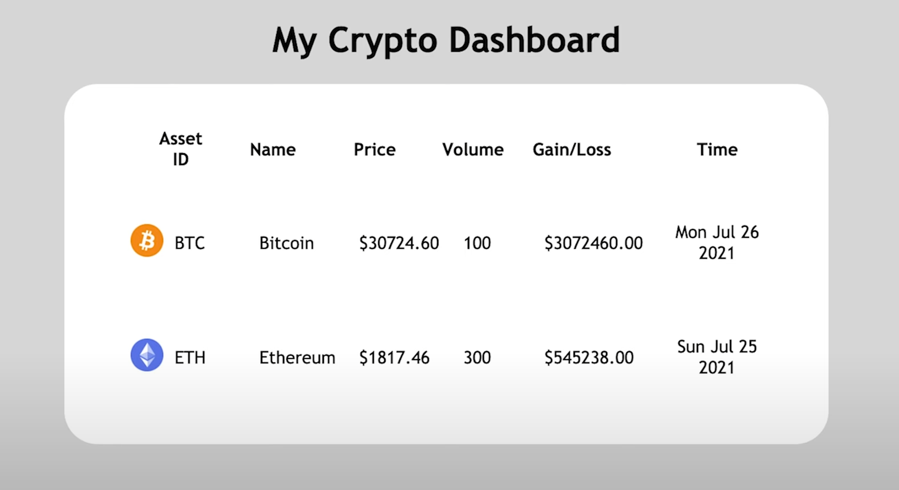

# Simple dashboard using apollo federation  

This is a schema first approach, schema to create db is in [schema.graphql file](./schema.graphql)  

React project is in [crypto-dashboard](./crypto-dashboard) folder.  

# To Run

Run `npm run start-deals` to serve deals, before you run `npm run gateway` because federation is going to point to port 4001 that is being opened by `start-deals`.   

To run FE run (make sure that `start-deals` and `gateway` are already running):
`cd crypto-dashboard`  
`npm start`  

